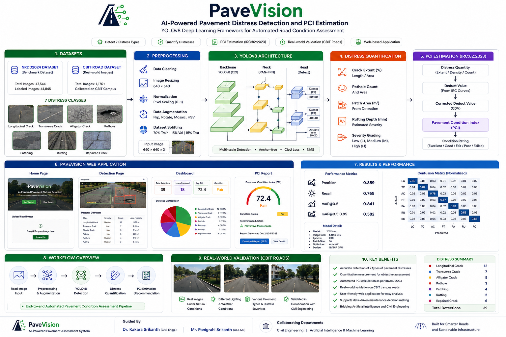
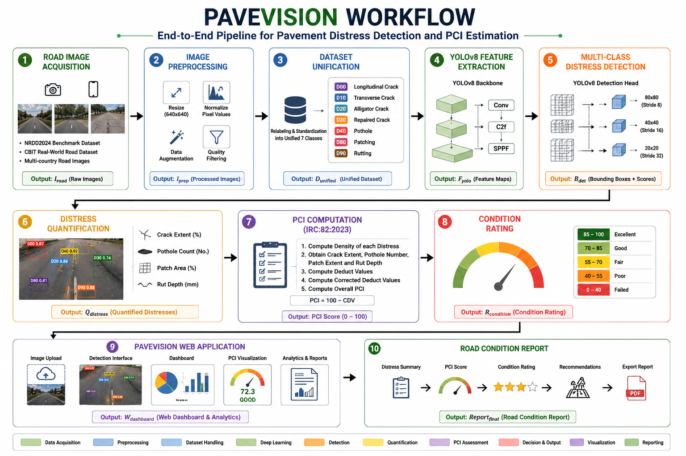

# PaveVision
PaveVision is an intelligent pavement monitoring platform that combines automated road distress detection, distress quantification, and Pavement Condition Index (PCI) estimation within a unified web application. The system utilizes YOLOv8 as its core deep learning backbone for pavement distress identification and classification, and has been validated using real-world CBIT campus road imagery through collaboration between Artificial Intelligence and Civil Engineering domains.

<p align="center">
  
</p>

<h1 align="center">PaveVision</h1>

<h3 align="center">
AI-Powered Pavement Distress Detection and PCI Estimation Using YOLOv8
</h3>

<p align="center">
  Automated Road Condition Assessment • Pavement Distress Analysis • IRC:82:2023 PCI Evaluation
</p>

<p align="center">
  
  
  
  
  
</p>

## Overview

PaveVision is an intelligent pavement assessment system that combines Deep Learning, Computer Vision, and Civil Engineering principles for automated road condition monitoring.

The system utilizes a YOLOv8-based object detection framework to identify, classify, and quantify various pavement distresses, including cracks, potholes, patching, and rutting. Detected distress information is further integrated with Pavement Condition Index (PCI) computation based on IRC:82:2023 guidelines to provide objective road condition assessment and maintenance recommendations.

In addition to benchmark evaluation using the NRDD2024 dataset, the system was validated using real-world road images collected from Chaitanya Bharathi Institute of Technology (CBIT), demonstrating its applicability in practical infrastructure monitoring scenarios.

---

## Proposed Architecture

<p align="center">
  
</p>

---

## workflow

<p align="center">
  
</p>

---

## Key Features

* Automated pavement distress detection using YOLOv8
* Detection of 7 pavement distress categories
* Pavement Condition Index (PCI) estimation
* Real-time web-based analysis platform
* Quantitative distress assessment
* Interactive analytics dashboard
* Real-world validation using CBIT road imagery
* Integration of Artificial Intelligence and Civil Engineering methodologies

---

## Distress Categories

The system detects and classifies the following pavement distresses:

| Class Code | Distress Type      |
| ---------- | ------------------ |
| D00        | Longitudinal Crack |
| D10        | Transverse Crack   |
| D20        | Alligator Crack    |
| D30        | Repaired Crack     |
| D40        | Pothole            |
| D80        | Patching           |
| D90        | Rutting            |

---

## System Workflow

1. Road Image Acquisition
2. Data Preprocessing and Augmentation
3. YOLOv8-Based Distress Detection
4. Distress Quantification
5. PCI Computation (IRC:82:2023)
6. Condition Rating Generation
7. Maintenance Recommendation

---

## Methodology

### Dataset Preparation

* Dataset: NRDD2024
* Multi-country road distress dataset
* Data cleaning and annotation verification
* Image resizing to 640 × 640
* Data augmentation techniques
* Train / Validation / Test split

### Deep Learning Model

The detection engine is built using YOLOv8, consisting of:

* Backbone: C2f Feature Extraction Network
* SPPF Module
* PAN-FPN Neck
* Decoupled Detection Head
* Anchor-Free Detection Strategy

### Distress Quantification

Detected defects are converted into measurable engineering parameters:

* Crack Extent (%)
* Pothole Count
* Patch Area
* Rut Depth

These measurements are used for pavement condition evaluation.

### PCI Estimation

The system computes Pavement Condition Index (PCI) using IRC:82:2023 guidelines.

PCI assessment includes:

* Distress density estimation
* Deduct value computation
* Corrected deduct value calculation
* Final pavement condition rating

---

## Web Application

PaveVision includes a complete web-based platform for:

* Road image upload
* Automated distress detection
* Visualization of detected defects
* PCI estimation
* Interactive analytics dashboard
* Road condition reporting

---

## Performance

### Overall Detection Performance

| Metric       | Value |
| ------------ | ----- |
| Precision    | 0.859 |
| Recall       | 0.765 |
| mAP@0.5      | 0.841 |
| mAP@0.5:0.95 | 0.582 |

The model demonstrates strong performance across multiple pavement distress categories under diverse road conditions.

---

## Real-World Validation

To evaluate generalization capability, an independent road dataset was collected from the campus roads of Chaitanya Bharathi Institute of Technology (CBIT).

The validation dataset includes:

* Internal campus roads
* Real traffic conditions
* Different lighting environments
* Surface variations
* Previously unseen pavement conditions

This evaluation confirms the practical applicability of the proposed system beyond benchmark datasets.

## CBIT Real-World Validation

To evaluate the generalization capability of PaveVision beyond benchmark datasets, a dedicated validation dataset was collected from road networks within the Chaitanya Bharathi Institute of Technology (CBIT) campus.

The collected images contain real pavement conditions, including potholes, transverse cracks, alligator cracking, patching, and repaired surfaces captured under diverse environmental and lighting conditions.

### Sample Validation Results

<p align="center">
  
</p>

<p align="center">
  
</p>

> **Note:** These images were independently collected from CBIT campus roads and were not part of the original benchmark dataset. They were used to evaluate the real-world deployment capability and generalization performance of the proposed PaveVision framework.

These results demonstrate the ability of the trained YOLOv8-based detection framework to identify multiple pavement distress types in previously unseen road environments.


---

## Project Structure

```text
PaveVision/
│
├── app/
│   ├── templates/
│   ├── static/
│   └── routes/
│
├── models/
│   └── yolov8_weights/
│
├── datasets/
│   ├── NRDD2024/
│   └── CBIT_Road_Dataset/
│
├── notebooks/
│
├── results/
│   ├── predictions/
│   ├── reports/
│   └── visualizations/
│
├── utils/
│
├── app.py
├── requirements.txt
├── README.md
└── LICENSE
```

---

## Applications

* Smart Road Infrastructure Monitoring
* Pavement Asset Management
* Municipal Road Maintenance
* Highway Condition Assessment
* Transportation Engineering Research
* Intelligent Infrastructure Systems

---

## Technologies Used

* Python
* YOLOv8
* PyTorch
* OpenCV
* NumPy
* Matplotlib
* Flask
* HTML
* CSS
* JavaScript

---

## Collaborating Departments

- Department of Civil Engineering
- Department of Artificial Intelligence & Machine Learning

---

## Project Team

This project was developed through a collaborative effort between the Departments of Civil Engineering and Artificial Intelligence & Machine Learning at Chaitanya Bharathi Institute of Technology (CBIT).

| Name | Department |
|--------|------------|
| **P. Sri Vinya Manju Bhargavi** | Civil Engineering |
| **Manoj Kumar Sunkara** | Artificial Intelligence & Machine Learning |
| **Kotla Geethika** | Artificial Intelligence & Machine Learning |

### Contributions

#### Civil Engineering Team
- Pavement distress analysis
- PCI assessment methodology
- Road condition evaluation
- Field data collection

#### AI & ML Team
- Deep learning model development
- YOLOv8 training and optimization
- Web application development
- Deployment and validation

---

## Guidance

### Academic Guide

Dr. Kakara Srikanth

Assistant Professor  
Department of Civil Engineering  
CBIT

### Co-Guide

Mr. Panigrahi Srikanth

Assistant Professor  
Department of Artificial Intelligence & Machine Learning  
CBIT

---

## Future Scope

* Distress Severity Classification
* GIS Integration
* Drone-Based Road Inspection
* Mobile Deployment
* Edge AI Inference
* Predictive Maintenance Analytics
* Smart City Infrastructure Monitoring

---

## License

This repository is intended for academic and research purposes.
Copyright © 2026 PaveVision.
